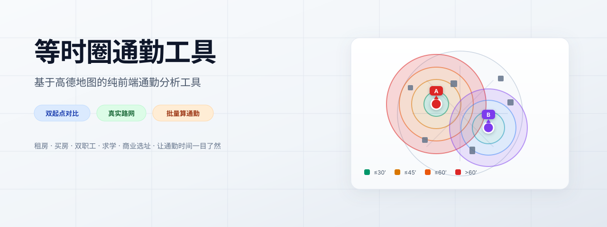

# 等时圈通勤工具

一个基于高德地图的纯前端等时圈工具。设定 1~2 个起点后，可以画出不同交通方式的等时圈，并在圈内检索或导入候选地点，批量计算真实通勤时间。



## 适用场景

- **租房/买房**：比较多个小区到公司/学校的通勤。
- **双职工家庭**：同时对比两人工作地点，找折中区域。
- **求学/培训**：住处到图书馆、培训机构或考点的通勤。
- **就医/陪护**：住处到医院，同时兼顾陪护人和工作地。
- **商业选址**：门店、仓库、办公室的服务半径与员工通勤覆盖。
- **旅行/出差**：酒店到客户公司、展馆、车站的耗时对比。

## 快速使用

1. 打开页面后，若已配置高德密钥，地图会自动加载；若未配置，会弹出密钥设置窗口。
2. **设置起点**：在「① 起点位置」搜索地点，或在地图上直接点击选点。最多可设置 A、B 两个起点。
3. **添加等时圈**：选择起点、交通方式和时长，点击「＋ 添加等时圈」。
   - 地铁/公交/地铁+公交：使用高德真实路网到达圈。
   - 步行/骑行：按平均速度画圆近似（步行≈2.8km/h，骑行≈9km/h）。
4. **查看候选地点**：
   - 点击「检索圈内地点」自动搜索圈内的住宅小区。
   - 或在「导入自己的候选清单」里粘贴地点列表，每行一个，可带城市名（如 `保利天悦,广州`）。
5. **批量算通勤**：点击「批量算通勤」，列表会按通勤时间排序。
6. **导出**：支持导出等时圈 GeoJSON 和候选地点 CSV。

## 高德密钥配置

本工具调用高德地图 JS API，需要提供 `Key` 和 `安全密钥（securityJsCode）`。

### 方式一：页面弹窗输入（推荐个人使用）

首次打开时若无密钥，页面会弹出输入框：

1. 前往 [console.amap.com](https://console.amap.com) 注册并登录。
2. 进入「应用管理」→「创建 Key」。
3. 服务平台选择 **「Web端(JS API)」**。
4. 创建后复制 Key；在 Key 的「安全设置」中获取 **安全密钥**。
5. 把两项填入页面弹窗，点击「保存并开始使用」。

密钥会保存在浏览器 `localStorage` 中，仅本地使用，不会上传到任何服务器。

### 方式二：修改 config.yaml

也可以直接修改仓库中的 `config.yaml`：

```yaml
amap_key: "你的 JS API Key"
amap_code: "你的安全密钥"

# 地图初始视角（GCJ-02 坐标，与高德一致）
map_center: "121.4997,31.2397"   # 上海陆家嘴
map_zoom: 12
```

> ⚠️ 注意：`config.yaml` 是静态文件，部署后浏览器可以访问到。如果你的仓库是公开的，请不要把真实密钥提交进去，否则等同于在前端暴露密钥。

## 数据说明

- 步行/骑行等时圈为直线距离近似，仅作快速参考。
- 地铁/公交等时圈来自高德到达圈，不包含等车与换乘步行时间，具体通勤以「批量算通勤」结果为准。
- 配色规则：≤30 分钟绿色，≤45 分钟黄色，≤60 分钟橙色，>60 分钟红色。
- 检索结果来自高德 POI，非实时房源/在售信息。

## 隐私说明

- 高德密钥、起点位置、等时圈和候选地点列表均只保存在浏览器本地（`localStorage`）。
- 除调用高德地图 API 外，本工具不会向任何其他服务器发送数据。
