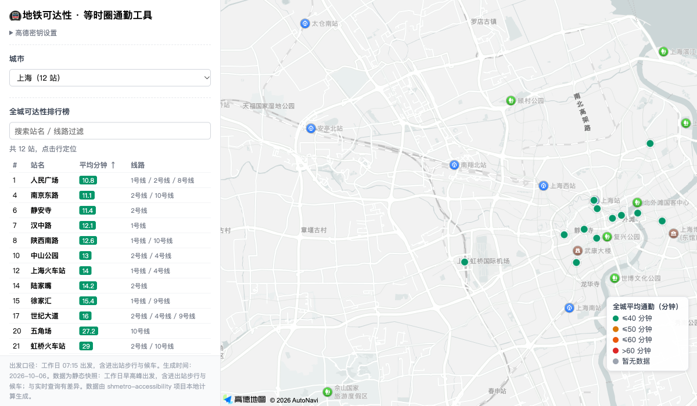
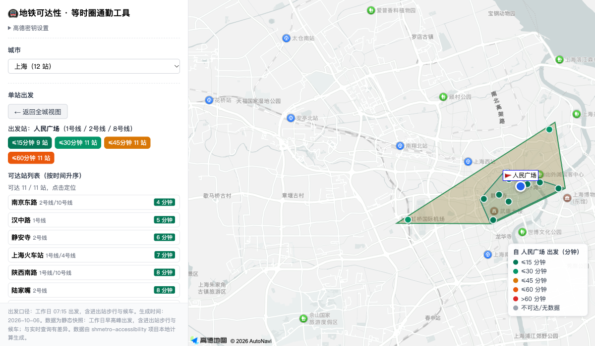

# 等时圈通勤工具

帮你在买房、租房、找工作、选址时，快速看清「住在哪、通勤要多久」。

**在线使用：<https://ignareo.github.io/CommuteTime/>**


## 这是什么

一个跑在浏览器里的地图工具，**打开即用、无需安装、无需登录**，包含两个页面：

- **通勤分析（`index.html`）** —— 回答「住这里去上班要多久」：设起点、画出 15 / 30 / 45 分钟能到达的区域（等时圈）、在圈内检索或粘贴候选小区，批量算出每个候选点的真实通勤时间并排序导出。
- **地铁可达性（`metro.html`）** —— 回答「哪里的地铁最通达」：基于离线预计算的全城地铁通勤时间矩阵，查看站点平均通勤排行，或从任一站点出发看它到全城的耗时与等值圈。

典型场景：

- **租房 / 买房**：同时对比几个小区到公司、学校的通勤，找性价比最高的那个。
- **双职工家庭**：两个工作地各画一圈，取交集就是两人都方便的区域。
- **求学 / 就医 / 出差**：住处到图书馆、医院、客户公司、展馆、车站的耗时对比。
- **开店 / 选址**：看清门店的服务半径，或员工通勤覆盖范围。

## 快速开始

本仓库**已默认配置好高德密钥**，克隆后用任意静态服务器打开就能用：

```bash
python3 -m http.server 8931 --bind 127.0.0.1
# 浏览器打开 http://127.0.0.1:8931/index.html
```

（也可以直接部署到任意静态托管，前端无需后端。）

进入页面后：

1. **设置起点**：在「① 起点位置」搜索地点，或点击地图后确认「设为起点」，可添加任意多个。点「🔗 复制分享链接」可把当前方案发给家人，对方打开自动重现。
2. **添加等时圈**：选起点、交通方式和时长，点「＋ 添加等时圈」。支持地铁/公交、步行/骑行、驾车，以及勾选「精确路网圈」走真实路径；圈列表可勾选显隐、批量改时长，每个圈显示本地计算的面积。
3. **选候选地点**：点「检索圈内地点」自动搜索圈内住宅小区，或在「导入自己的候选清单」里粘贴每行一个地点（可带城市名，如 `保利天悦,广州`）。
4. **批量算通勤**：点「批量算通勤」，按耗时排序（交集/差集模式下只算显示区域）。
5. **导出**：支持导出 GeoJSON（含面积）与候选 CSV；「⬇ 导出方案包」可把全部起点与圈存成纯文本，跨设备导入零配额秒恢复。

## 地铁可达性（`metro.html`）

姊妹页面，展示**离线预计算**的城市地铁 N×N 通勤时间矩阵（含进出站步行与候车，工作日早高峰口径）：

- **全城可达性**：所有站点按「到其他各站的平均通勤时间」上色，附排行榜。
- **单站出发**：点击任一站点，按真实站间时间给全城上色，并画 15/30/45/60 分钟等值圈。

 

无密钥时可跳过弹窗纯数据浏览（地图区显示占位层，排行榜/单站列表照常可用）。

## 隐私说明

- 高德/Mapbox 密钥、起点位置、等时圈和候选地点列表均只保存在浏览器本地（`localStorage`）；
- 除调用高德地图 / Mapbox API 外，本工具不会向任何其他服务器发送数据。

## 开发者

想继续开发或自建数据，请先看这份速查，细节都在 `docs/` 里：

- **本地运行**：纯静态、无构建，`python3 -m http.server 8931 --bind 127.0.0.1` 即可。代码约定见 [AGENTS.md](AGENTS.md)。
- **高德密钥**：默认已在 `config.yaml` 预配置；页面不展示密钥（仅无密钥/失效时弹窗引导），解析优先级为 `localStorage` → `config.yaml` → 弹窗。公开仓库**不要**提交真实密钥。申请与替换方法见 [docs/development.md](docs/development.md#高德密钥配置)。
- **底层算法与机制**：等时圈的三类实现（到达圈 / 直线近似 / 精确路网二分）、交集差集（polygon-clipping）、几何压缩缓存（lz-string）、限流退避；地铁页的分片矩阵、凸包外扩等值圈。见 [docs/development.md](docs/development.md#底层算法与机制)。
- **地铁数据管线**：`output/*.csv` → `tools/build_metro_data.py` → `data/`，含数据契约与已知坑。见 [docs/metro-data.md](docs/metro-data.md)。

## 许可与致谢

本项目以 **GNU General Public License v3.0** 发布，详见 [LICENSE](LICENSE)。

它由以下项目修改而来，在此致谢：

- 在线示例：https://zwssunny.github.io/
- 源码仓库：https://github.com/zwssunny/zwssunny.github.io
- `metro.html` 及其 `data/` 中的地铁通勤数据来自黑卡蒂的 [Hecate2/shmetro-accessibility](https://github.com/Hecate2/shmetro-accessibility)，实际同步用的是其 fork [Ignareo/shmetro-accessibility](https://github.com/Ignareo/shmetro-accessibility)。
